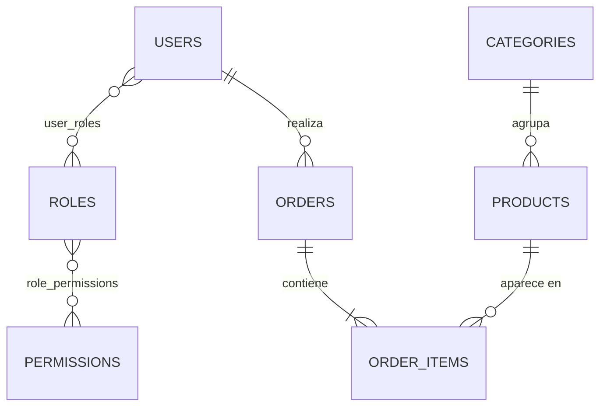

# Taller 2 - JPA con Spring Boot (Tienda)

**Curso:** Computación en Internet II
**Estudiante:** Juan Daniel Torres
**Docentes:** Kevin Rodríguez

Backend en Spring Boot que usa Hibernate a través de Spring Data JPA para gestionar una tienda:
usuarios con roles y permisos, categorías, productos y pedidos.

---

## Tecnologías

| Herramienta | Versión |
|---|---|
| Java | 17 |
| Spring Boot | 4.0.8 |
| Spring Data JPA / Hibernate | incluido en Spring Boot |
| H2 Database (en memoria) | incluido en Spring Boot |
| Lombok | incluido en Spring Boot |
| JUnit 5 / Mockito | incluido en `spring-boot-starter-test` |
| JaCoCo | 0.8.15 |
| Maven | wrapper incluido (`./mvnw`) |

---

## Modelo de datos



| Entidad | Tabla | Relaciones |
|---|---|---|
| `Permission` | `permissions` | N–M con `Role` (unidireccional desde `Role`) |
| `Role` | `roles` | N–M con `Permission` mediante `role_permissions` |
| `User` | `users` | N–M con `Role` mediante `user_roles`; 1–N con `Order` |
| `Category` | `categories` | 1–N con `Product` |
| `Product` | `products` | N–1 con `Category` |
| `Order` | `orders` | N–1 con `User`; 1–N con `OrderItem` (cascade) |
| `OrderItem` | `order_items` | N–1 con `Order` y N–1 con `Product` |

### Reglas de negocio
- **No existen usuarios sin rol:** `UserService` exige al menos un rol al crear o actualizar, y no permite quitar el último rol.
- **No existen roles sin permisos:** `RoleService` exige al menos un permiso al crear o actualizar, y no permite quitar el último permiso.
- **Eliminar un rol** se rechaza si deja a algún usuario sin roles.
- **Eliminar un permiso** se rechaza si deja a algún rol sin permisos.
- **Eliminar un usuario** se rechaza si tiene pedidos registrados.
- `username`, `email` y los nombres de rol y permiso son únicos.

---

## Estructura del proyecto

```
src/main/java/com/example/demo/
├── model/          Entidades JPA (7)
├── repository/     Repositorios Spring Data (uno por entidad)
└── service/        Interfaces de servicio (User, Role, Permission)
    └── impl/       Implementaciones con las reglas de negocio
src/main/resources/
├── application.properties   Configuración (H2, JPA, scripts)
├── schema.sql               Creación del esquema
└── data.sql                 Carga de datos iniciales
src/test/java/com/example/demo/service/impl/
                             Tests unitarios con JUnit 5 y Mockito
```

---

## Esquema y datos iniciales

Al arrancar, Spring ejecuta automáticamente:
1. **`schema.sql`**: borra y crea las 9 tablas con sus claves primarias, foráneas y restricciones `UNIQUE` y `NOT NULL`.
2. **`data.sql`**: inserta los datos de prueba.

Hibernate está configurado con `ddl-auto=validate`: no crea tablas, solo verifica que las entidades coincidan con el esquema del script.

| Tabla | Registros |
|---|---|
| permissions | 8 |
| roles | 3 (ADMIN, SELLER, CUSTOMER) |
| role_permissions | 15 |
| users | 5 |
| user_roles | 6 |
| categories | 4 |
| products | 8 |
| orders | 3 |
| order_items | 6 |

---

## Requisitos

- **Java 17** o superior. Se comprueba con `java -version`.
- No hace falta instalar Maven ni una base de datos: el proyecto trae el Maven Wrapper y usa H2 en memoria.

---

## Cómo ejecutar

```bash
git clone https://github.com/Computacion-2/taller-jpa-juan-daniel-torres.git
cd taller-jpa-juan-daniel-torres
./mvnw spring-boot:run
```

La aplicación arranca en `http://localhost:8080`.

### Consultar la base de datos (consola H2)

1. Abrir `http://localhost:8080/h2-console`.
2. Ingresar estos datos:
   - **JDBC URL:** `jdbc:h2:mem:tiendadb`
   - **User Name:** `sa`
   - **Password:** (vacío)
3. Ejemplos de consultas:

```sql
-- Usuarios con sus roles
SELECT u.username, r.name AS rol
FROM users u
JOIN user_roles ur ON ur.user_id = u.id
JOIN roles r ON r.id = ur.role_id;

-- Permisos de cada rol
SELECT r.name AS rol, p.name AS permiso
FROM roles r
JOIN role_permissions rp ON rp.role_id = r.id
JOIN permissions p ON p.id = rp.permission_id;

-- Pedidos con sus ítems
SELECT o.id, u.username, p.name, i.quantity, i.unit_price
FROM orders o
JOIN users u ON u.id = o.user_id
JOIN order_items i ON i.order_id = o.id
JOIN products p ON p.id = i.product_id;
```

### Generar y ejecutar el JAR

```bash
./mvnw clean package
java -jar target/demo-0.0.1-SNAPSHOT.jar
```

---

## Pruebas

### Ejecutar todos los tests
```bash
./mvnw test
```
Resultado esperado: **76 tests, 0 fallos**.

| Clase de prueba | Tests | Qué cubre |
|---|---|---|
| `PermissionServiceImplTest` | 19 | Consulta, inserción, actualización y eliminación; nombre duplicado; no dejar roles sin permisos |
| `RoleServiceImplTest` | 26 | CRUD; asignar y quitar permisos; no crear roles sin permisos; no dejar usuarios sin rol |
| `UserServiceImplTest` | 30 | CRUD; username y email duplicados; contraseña; asignar y quitar roles; no crear usuarios sin rol |
| `DemoApplicationTests` | 1 | El contexto de Spring carga con el esquema y los datos |

Los tests de servicios son unitarios: usan **Mockito** para simular los repositorios, así que no dependen de la base de datos.

Para ejecutar una sola clase:
```bash
./mvnw test -Dtest=UserServiceImplTest
```

---

## Cobertura (JaCoCo)

```bash
./mvnw clean verify
open target/site/jacoco/index.html      # macOS
xdg-open target/site/jacoco/index.html  # Linux
```

- El reporte se genera en `target/site/jacoco/index.html`.
- `verify` incluye una **regla que exige 100% de líneas y ramas** en `com.example.demo.service.impl`. Si la cobertura baja, el build falla.

| Servicio | Líneas | Ramas |
|---|---|---|
| `PermissionServiceImpl` | 100% | 100% |
| `RoleServiceImpl` | 100% | 100% |
| `UserServiceImpl` | 100% | 100% |


---

## Despliegue en IAsLab

La aplicación se desplegó en un equipo de la sala IAsLab (Linux, OpenJDK 17.0.20, Git 2.43).

**Equipo de despliegue:** IAsLab, IP `192.168.131.78`
**Consola H2 (desde la red del laboratorio):** `http://192.168.131.78:8080/h2-console`

### Pasos realizados en el equipo

1. Verificar herramientas:
   ```bash
   java -version
   git --version
   ```
2. Clonar el repositorio (autenticación con *personal access token* de GitHub):
   ```bash
   git clone https://github.com/Computacion-2/taller-jpa-juan-daniel-torres.git
   cd taller-jpa-juan-daniel-torres
   chmod +x mvnw
   ```
3. Compilar, ejecutar los tests y validar la cobertura:
   ```bash
   ./mvnw clean verify
   ```
   Resultado esperado: `Tests run: 76, Failures: 0`, `All coverage checks have been met.` y `BUILD SUCCESS`.
4. Ejecutar la aplicación habilitando el acceso remoto a la consola H2:
   ```bash
   java -jar target/demo-0.0.1-SNAPSHOT.jar --spring.h2.console.settings.web-allow-others=true
   ```
   Para dejarla en segundo plano:
   ```bash
   nohup java -jar target/demo-0.0.1-SNAPSHOT.jar --spring.h2.console.settings.web-allow-others=true > app.log 2>&1 &
   tail -f app.log
   ```
   Debe aparecer `Started DemoApplication`.
5. Obtener la IP del equipo con `hostname -I`. El equipo tiene varias interfaces; la que comparte red con los demás equipos del laboratorio es `192.168.131.78`. Las IP `172.x.x.x` son redes internas de Docker y no sirven.
6. Verificar desde otro equipo de la misma red, en `http://192.168.131.78:8080/h2-console`, con estos datos:
   - **JDBC URL:** `jdbc:h2:mem:tiendadb`
   - **User Name:** `sa`
   - **Password:** (vacío)
7. Detener la aplicación con `Ctrl+C`, o con `pkill -f demo-0.0.1-SNAPSHOT.jar` si se dejó en segundo plano.

> `web-allow-others` se pasa como argumento y no en `application.properties`, para que por defecto la consola H2 solo acepte conexiones locales.

---

## Videos

- Ejecución y datos iniciales: `<enlace>`
- Tests y cobertura JaCoCo: `<enlace>`
- Despliegue en IAsLab: `<enlace>`