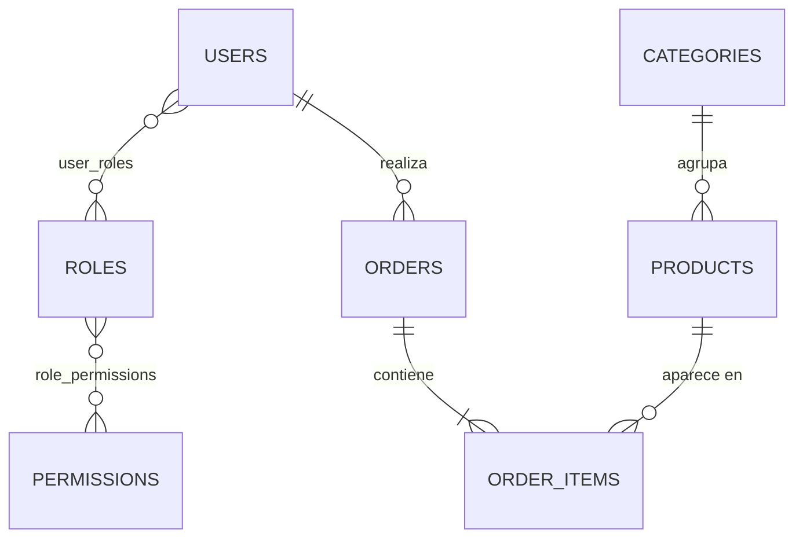
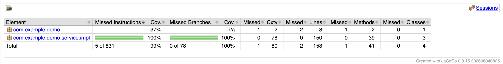

# Taller 2 - JPA con Spring Boot (Tienda)

**Curso:** Computación en Internet II
**Estudiante:** Juan Daniel Torres
**Docentes:** Kevin Rodríguez

Este es el backend de una tienda hecho con Spring Boot. Usa Spring Data JPA (con Hibernate por debajo) para guardar y leer todo de la base de datos: usuarios con sus roles y permisos, categorías, productos y pedidos.

---

## Con qué está hecho

| Herramienta | Versión |
|---|---|
| Java | 17 |
| Spring Boot | 4.1.1 |
| Hibernate (vía Spring Data JPA) | 7.4.5 |
| Base de datos H2 (en memoria) | 2.4.240 |
| Lombok | 1.18.46 |
| JUnit (Jupiter) | 6.0.3 |
| Mockito | 5.23.0 |
| JaCoCo | 0.8.15 |
| Maven | viene incluido en el proyecto (`./mvnw`) |

---

## El modelo



Son 7 entidades:

| Entidad | Tabla | Con quién se relaciona |
|---|---|---|
| `Permission` | `permissions` | Con `Role`. La relación la maneja `Role`. |
| `Role` | `roles` | Tiene muchos permisos, y un permiso puede estar en muchos roles (tabla `role_permissions`). |
| `User` | `users` | Tiene muchos roles (tabla `user_roles`) y muchos pedidos. |
| `Category` | `categories` | Agrupa muchos productos. |
| `Product` | `products` | Pertenece a una categoría. |
| `Order` | `orders` | Es de un usuario y tiene varios ítems. Si guardas o borras el pedido, sus ítems van con él. |
| `OrderItem` | `order_items` | Apunta a su pedido y a su producto. |

### Reglas que siempre se cumplen
- **Ningún usuario se queda sin rol.** No puedes crear un usuario sin rol ni quitarle su último rol.
- **Ningún rol se queda sin permisos.** No puedes crear un rol sin permisos ni quitarle su último permiso.
- **No puedes borrar un rol** si algún usuario se quedaría sin roles por eso.
- **No puedes borrar un permiso** si algún rol se quedaría sin permisos por eso.
- **No puedes borrar un usuario** que tenga pedidos.
- No se repiten el `username`, el `email` ni los nombres de roles y permisos.

---

## Cómo está organizado

```
src/main/java/com/example/demo/
├── model/          Las 7 entidades
├── repository/     Un repositorio por entidad
└── service/        Servicios de User, Role y Permission
    └── impl/       Aquí están las reglas de arriba
src/main/resources/
├── application.properties   Configuración (H2, JPA y scripts)
├── schema.sql               Crea las tablas
└── data.sql                 Mete los datos de ejemplo
src/test/java/com/example/demo/service/impl/
                             Las pruebas de los servicios
```

---

## Las tablas y los datos de ejemplo

Cada vez que arranca la app, Spring corre dos scripts:
1. **`schema.sql`**: borra y vuelve a crear las 9 tablas, con sus llaves y restricciones.
2. **`data.sql`**: llena las tablas con datos de ejemplo.

Hibernate está en modo `validate`: no crea tablas por su cuenta, solo revisa que las entidades cuadren con lo que crearon los scripts. Si algo no cuadra, la app no arranca.

Esto es lo que queda cargado:

| Tabla | Filas |
|---|---|
| permissions | 8 |
| roles | 3 (ADMIN, SELLER y CUSTOMER) |
| role_permissions | 15 |
| users | 5 |
| user_roles | 6 |
| categories | 4 |
| products | 8 |
| orders | 3 |
| order_items | 6 |

---

## Qué necesitas

- **Java 17 o más nuevo.** Revisa tu versión con `java -version`.
- Nada más: Maven viene con el proyecto y la base de datos es H2 en memoria, así que no hay que instalar ninguno de los dos.

---

## Cómo correrlo

```bash
git clone https://github.com/Computacion-2/taller-jpa-juan-daniel-torres.git
cd taller-jpa-juan-daniel-torres
./mvnw spring-boot:run
```

La app queda corriendo en `http://localhost:8080`.

### Ver la base de datos

1. Entra a `http://localhost:8080/h2-console`.
2. Llena así:
   - **JDBC URL:** `jdbc:h2:mem:tiendadb` (ojo, por defecto viene otra)
   - **User Name:** `sa`
   - **Password:** déjalo vacío
3. Prueba estas consultas:

```sql
-- Cada usuario con sus roles
SELECT u.username, r.name AS rol
FROM users u
JOIN user_roles ur ON ur.user_id = u.id
JOIN roles r ON r.id = ur.role_id;

-- Los permisos de cada rol
SELECT r.name AS rol, p.name AS permiso
FROM roles r
JOIN role_permissions rp ON rp.role_id = r.id
JOIN permissions p ON p.id = rp.permission_id;

-- Los pedidos con lo que se compró
SELECT o.id, u.username, p.name, i.quantity, i.unit_price
FROM orders o
JOIN users u ON u.id = o.user_id
JOIN order_items i ON i.order_id = o.id
JOIN products p ON p.id = i.product_id;
```

### Correrlo como JAR

```bash
./mvnw clean package
java -jar target/demo-0.0.1-SNAPSHOT.jar
```

---

## Pruebas

Para correrlas todas:
```bash
./mvnw test
```
Deberían pasar las **76, sin ningún fallo**.

| Clase | Pruebas | Qué revisa |
|---|---|---|
| `PermissionServiceImplTest` | 19 | Buscar, crear, editar y borrar permisos; que no se repita el nombre; que ningún rol se quede sin permisos |
| `RoleServiceImplTest` | 26 | Buscar, crear, editar y borrar roles; agregar y quitar permisos; que ningún rol quede vacío y ningún usuario sin rol |
| `UserServiceImplTest` | 30 | Buscar, crear, editar y borrar usuarios; username y email repetidos; la contraseña; agregar y quitar roles |
| `DemoApplicationTests` | 1 | Que la app completa arranque bien con las tablas y los datos |

Las pruebas de los servicios usan **Mockito**: los repositorios se reemplazan por unos "falsos", así que se prueba solo la lógica, sin tocar la base de datos.

Si quieres correr solo una clase:
```bash
./mvnw test -Dtest=UserServiceImplTest
```

---

## Cobertura con JaCoCo

```bash
./mvnw clean verify
open target/site/jacoco/index.html      # en Mac
xdg-open target/site/jacoco/index.html  # en Linux
```

- El reporte queda en `target/site/jacoco/index.html`.
- `verify` trae una regla: si los servicios bajan del **100% de líneas y ramas cubiertas**, el build falla. Así no se cuela código sin probar.

| Servicio | Líneas | Ramas |
|---|---|---|
| `PermissionServiceImpl` | 100% | 100% |
| `RoleServiceImpl` | 100% | 100% |
| `UserServiceImpl` | 100% | 100% |



---

## Despliegue en IAsLab

La app quedó desplegada en un computador de la sala IAsLab (Linux, Java 17.0.20, Git 2.43).

- **IP del equipo:** `192.168.131.78`
- **Consola H2 desde la red del laboratorio:** `http://192.168.131.78:8080/h2-console`

### Lo que se hizo en ese computador

1. Revisar que estuvieran Java y Git:
   ```bash
   java -version
   git --version
   ```
2. Clonar el repo. Como es privado, GitHub pide un *personal access token* en vez de la contraseña.
   ```bash
   git clone https://github.com/Computacion-2/taller-jpa-juan-daniel-torres.git
   cd taller-jpa-juan-daniel-torres
   chmod +x mvnw
   ```
3. Compilar y correr las pruebas con la regla de cobertura:
   ```bash
   ./mvnw clean verify
   ```
   Al final debe salir `Tests run: 76, Failures: 0`, `All coverage checks have been met.` y `BUILD SUCCESS`.
4. Arrancar la app dejando que otros equipos entren a la consola H2:
   ```bash
   java -jar target/demo-0.0.1-SNAPSHOT.jar --spring.h2.console.settings.web-allow-others=true
   ```
   Si la quieres dejar corriendo en segundo plano:
   ```bash
   nohup java -jar target/demo-0.0.1-SNAPSHOT.jar --spring.h2.console.settings.web-allow-others=true > app.log 2>&1 &
   tail -f app.log
   ```
   Sabes que arrancó cuando sale `Started DemoApplication`.
5. Sacar la IP con `hostname -I`. Salen varias. La que sirve es la de la red del laboratorio, `192.168.131.78`; las que empiezan por `172.` son de Docker y no sirven para esto.
6. Desde otro computador conectado a la misma red, entrar a `http://192.168.131.78:8080/h2-console` con:
   - **JDBC URL:** `jdbc:h2:mem:tiendadb`
   - **User Name:** `sa`
   - **Password:** vacío
7. Para apagarla: `Ctrl+C`, o `pkill -f demo-0.0.1-SNAPSHOT.jar` si quedó en segundo plano.

> La opción `web-allow-others` se pasa solo al arrancar y no está en `application.properties`. Así, normalmente la consola H2 solo acepta conexiones del mismo computador, que es más seguro.

---

## Video

Un solo video recorre todo: el modelo, las tablas y los datos, los servicios, las pruebas con JaCoCo y el despliegue en IAsLab.

- Video del taller: `https://drive.google.com/file/d/1zl8XsSeTNXh5DIcZDToUR3k0N0yP5e3r/view?usp=drive_link`
